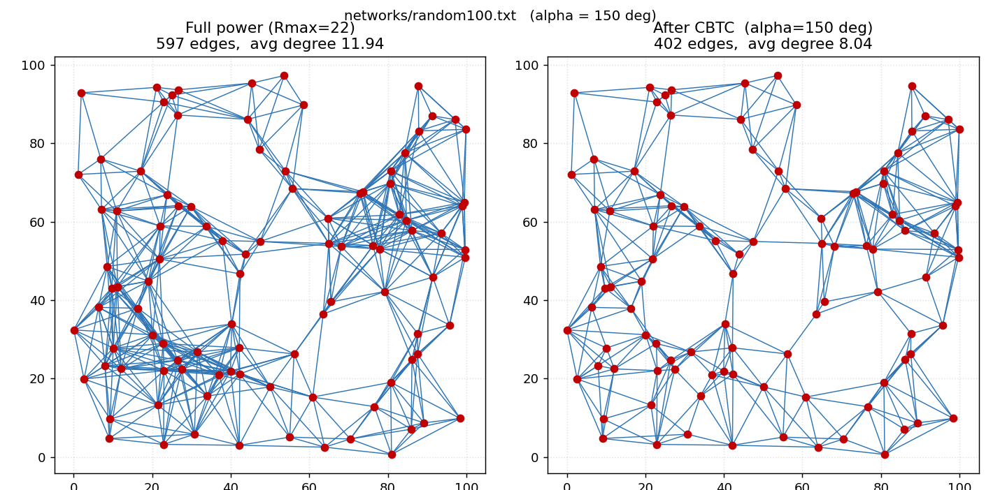
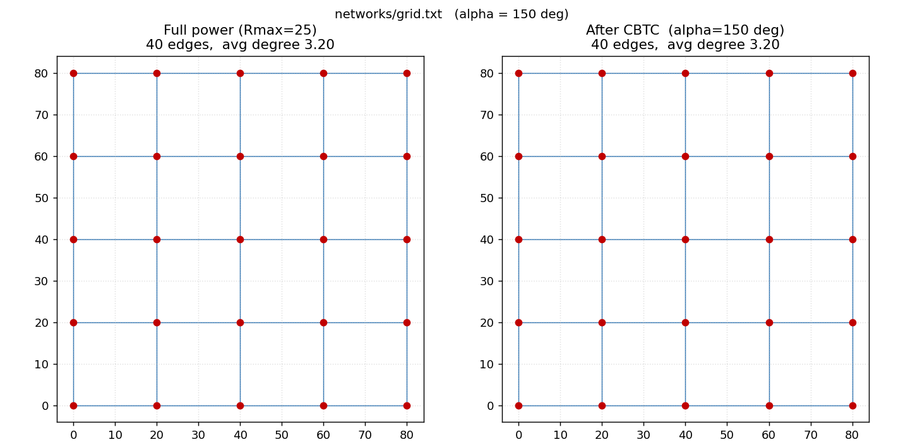
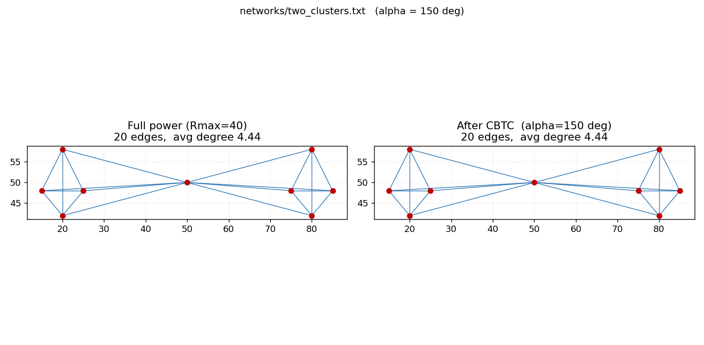
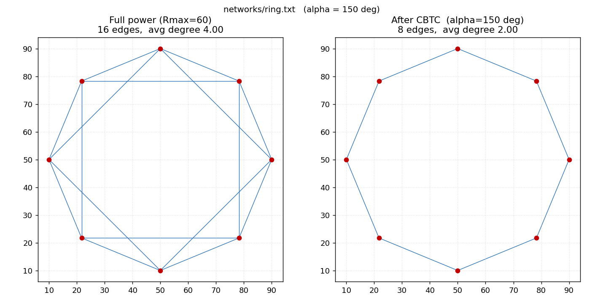
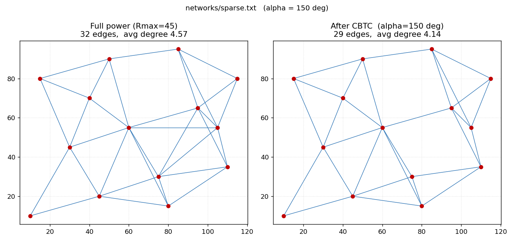
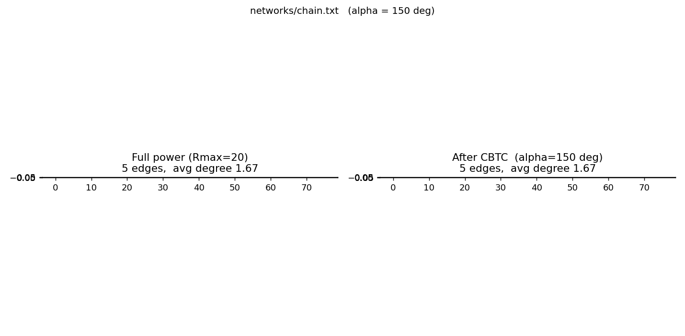
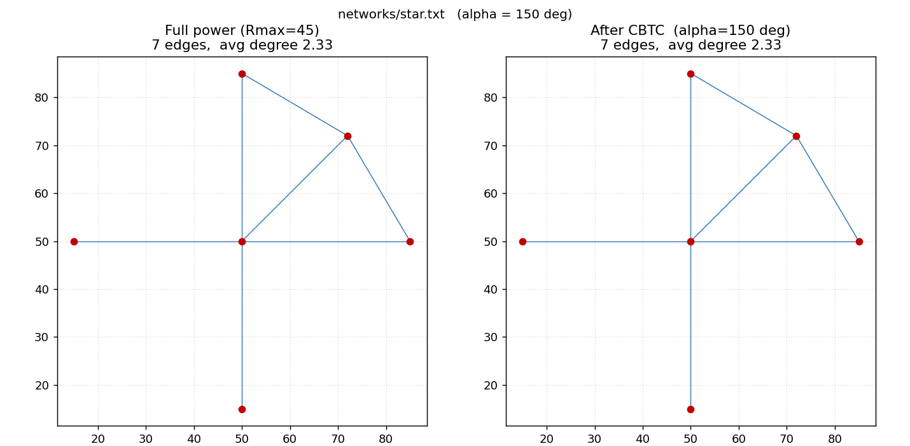
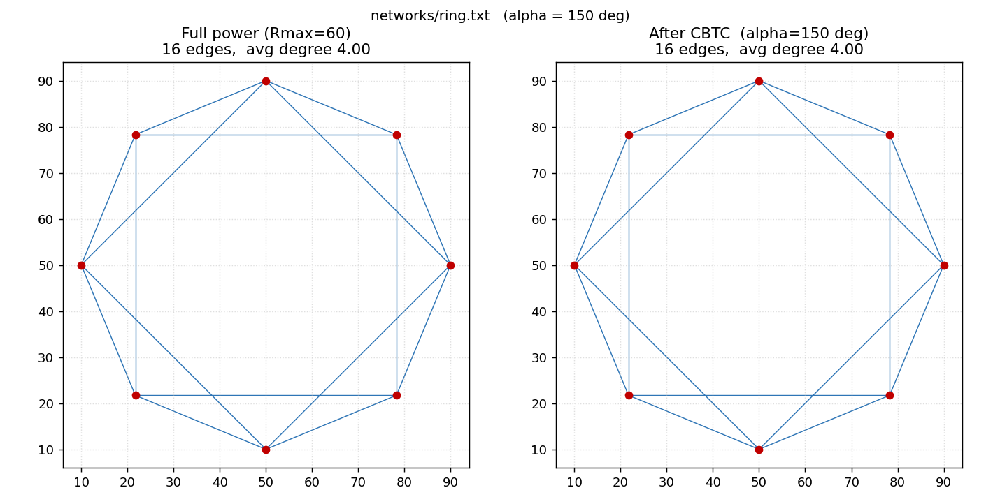
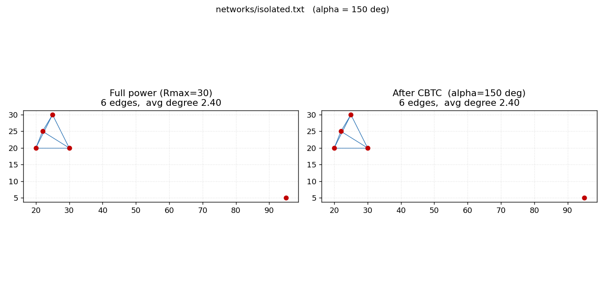

# CBTC — Cone-Based Topology Control

Υλοποίηση και πειραματική μελέτη του αλγορίθμου **Cone-Based Topology Control (CBTC)** σε C.

- **[Paper]** L. Li, J. Y. Halpern, P. Bahl, Y.-M. Wang, R. Wattenhofer, *"A cone-based
  distributed topology-control algorithm for wireless multi-hop networks"*, **IEEE/ACM
  Transactions on Networking, 13(1):147–159, 2005**.
- **[Βιβλίο]** H. Karl & A. Willig, *"Protocols and Architectures for Wireless Sensor
  Networks"*, **Κεφάλαιο 10 — Topology Control** (§10.1, §10.2.2, §10.2.3).

---

## 1. Ο αλγόριθμος (με αναφορά στο Κεφάλαιο 10 του βιβλίου)

**Κίνητρο (§10.1).** Σε ένα ad hoc / αισθητήρων δίκτυο κάθε κόμβος ρυθμίζει την **ισχύ
εκπομπής** του. Αν όλοι εκπέμπουν στη μέγιστη ισχύ, σπαταλιέται ενέργεια, αυξάνονται οι
παρεμβολές και μειώνεται η χωρητικότητα. Ο **έλεγχος τοπολογίας** μειώνει την ισχύ/τους
γείτονες κάθε κόμβου, **χωρίς να χαθεί η συνεκτικότητα** του δικτύου.

**Πού ανήκει ο CBTC (§10.2).** Είναι αλγόριθμος **flat power control**: κάθε κόμβος επιλέγει
ισχύ τοπικά, χωρίς ιεραρχία. Το βιβλίο τον περιγράφει στο **§10.2.3** ως αλγόριθμο **δύο
φάσεων** που χρειάζεται **μόνο πληροφορία κατεύθυνσης** (angle-of-arrival), όχι GPS.

**Φάση 1 — η συνθήκη κώνου.** Ο κόμβος *u* αυξάνει σταδιακά την ισχύ του μέχρι, **σε κάθε
κώνο γωνίας α** γύρω του, να υπάρχει τουλάχιστον ένας γείτονας. Ισοδύναμα: το **μέγιστο
γωνιακό κενό** μεταξύ διαδοχικών γειτόνων να είναι ≤ α. Το **θεμελιώδες θεώρημα** του paper:

> Αν **α ≤ 5π/6 (= 150°)** και το γράφημα μέγιστης ισχύος είναι συνεκτικό, τότε και το
> γράφημα του CBTC είναι συνεκτικό. Το **5π/6 είναι το ακριβές (tight) όριο**.

**Φάση 2 — βελτιστοποιήσεις.** Κυρίως το **shrink-back**: ένας κόμβος συνόρου που έφτασε στη
μέγιστη ισχύ με μη-καλύψιμο κενό «ξεφουσκώνει» την ισχύ του, αφαιρώντας μακρινούς γείτονες
χωρίς να ανοίγει νέο κενό, ώστε να εξοικονομήσει ενέργεια. (Το paper προσθέτει και
*asymmetric / pairwise edge removal*.)

**«Μαγικοί αριθμοί» (§10.2.2).** Δεν υπάρχει σταθερός αριθμός γειτόνων που να εγγυάται
συνεκτικότητα· γι' αυτό μετράμε **εμπειρικά** τον μέσο βαθμό — και βλέπουμε ότι ο CBTC τον
σταθεροποιεί γύρω σε μια **μικρή σταθερά**.

---

## 2. Δομή & εκτέλεση

```
src/cbtc.c             ο αλγόριθμος (CBTC + shrink-back + έλεγχος συνεκτικότητας)
networks/*.txt         τα δίκτυα εισόδου
plot_topology.py       οπτικοποίηση «πλήρης ισχύς vs CBTC»
run_experiments.sh     τρέχει όλη τη σάρωση και παράγει results/ edges/ figures/
results/  edges/  figures/   τα παραγόμενα αποτελέσματα
```

```bash
# μεμονωμένη εκτέλεση
gcc -Wall -Wextra -O2 src/cbtc.c -o cbtc -lm
./cbtc networks/grid.txt --alpha 150 --edges grid.edges    # μετρικές + ακμές

# όλη η σάρωση: α = 120/150/180, με & χωρίς shrink, για όλα τα δίκτυα
./run_experiments.sh
```

Η έξοδος κάθε εκτέλεσης δίνει: μέσο βαθμό, ελάχιστο/μέγιστο βαθμό, **μέγιστη ακτίνα (ισχύ)**,
**συνολική ενέργεια (Σ ακτίνα²)** και πλήθος **συνεκτικών συνιστωσών**.

---

## 3. Τα δίκτυα που χρησιμοποιήσαμε και γιατί

Διαλέξαμε δίκτυα που είτε **συναντάμε συχνά** είτε πιέζουν τις **οριακές περιπτώσεις** της
συνθήκης κώνου:

| Δίκτυο | Τύπος | Γιατί το χρησιμοποιούμε |
|--------|-------|--------------------------|
| `random100` | συνηθισμένο | πυκνό τυχαίο πεδίο — η «μέση περίπτωση»· δείχνει τη δραματική μείωση βαθμού/ενέργειας |
| `sparse` | συνηθισμένο | αραιό, απλωμένο δίκτυο — μεγάλες ζεύξεις, ώστε να φαίνεται καθαρά η **διαφορά ισχύος** |
| `grid` | συνηθισμένο | κανονικό πλέγμα — εύκολη **επαλήθευση με το χέρι** (γωνίες πολλαπλάσια των 90°) |
| `chain` | οριακό | συγγραμμικοί κόμβοι — κενό 180° > 150°, όλοι φτάνουν στη μέγιστη ισχύ |
| `star` | οριακό | αστέρας — τα φύλλα έχουν έναν μόνο γείτονα (κενό 360°) |
| `ring` | οριακό | κόμβοι σε κυρτή θέση — κενός εξωτερικός κώνος, φαινόμενο συνόρου |
| `two_clusters` | οριακό | δύο συστάδες + γέφυρα — η **κρίσιμη ζεύξη** πρέπει να επιβιώσει |
| `isolated` | εκφυλισμένο | ένας απρόσιτος κόμβος — έλεγχος ότι ο κώδικας δηλώνει DISCONNECTED χωρίς να κρασάρει |

---

## 4. Αποτελέσματα — επαληθεύουν τα γραφήματα και η ενέργεια τον αλγόριθμο;

Σύντομη απάντηση: **ναι** — επαληθεύονται και ο βασικός CBTC και το shrink-back, τόσο από τα
γραφήματα όσο και από τους αριθμούς ενέργειας. Το shrink-back (πιστό πλέον στην **Ενότητα
III-A** του paper) εξοικονομεί ενέργεια **διατηρώντας** τη συνεκτικότητα.

### 4.1 Διατήρηση συνεκτικότητας (το θεώρημα 5π/6)

Χωρίς shrink-back, **όλα τα συνεκτικά δίκτυα παρέμειναν συνεκτικά για α ≤ 150°** — ακριβώς
ό,τι εγγυάται το θεώρημα. Το `isolated` βγαίνει DISCONNECTED σε κάθε α (όπως πρέπει, αφού
έχει απρόσιτο κόμβο), επιβεβαιώνοντας τον σωστό χειρισμό της εκφυλισμένης περίπτωσης.

Σημείωση: ακόμη και στις **180°** τα πυκνά δίκτυα (`random100`, `two_clusters`) έμειναν
συνεκτικά. Αυτό **δεν** αντιφάσκει με το θεώρημα: το 5π/6 είναι **ικανή** συνθήκη, όχι
αναγκαία για κάθε τοπολογία — η πλεονάζουσα συνδεσιμότητα των πυκνών δικτύων κρατά τη
συνεκτικότητα και πάνω από το κατώφλι.

### 4.2 Ενέργεια & βαθμός vs α — η βασική επαλήθευση

Όσο **μεγαλώνει** το α, η συνθήκη χαλαρώνει, οι κόμβοι σταματούν σε **χαμηλότερη ισχύ**, και
ενέργεια/βαθμός **μειώνονται μονότονα**. Φαίνεται καθαρά στα **ανομοιόμορφα** δίκτυα:

| Δίκτυο | μετρική | πλήρης ισχύς | α=120° | α=150° | α=180° |
|--------|---------|--------------|--------|--------|--------|
| `random100` | ενέργεια (Σr²) | 48 400 | 34 264 | 25 540 | 20 341 |
| `random100` | μέσος βαθμός | 11.94 | 10.20 | 8.04 | 6.26 |
| `sparse` | ενέργεια (Σr²) | 28 350 | 20 550 | 19 250 | 19 125 |
| `sparse` | μέσος βαθμός | — | 4.43 | 4.14 | 4.00 |

Δύο πράγματα επαληθεύονται εδώ: (α) ο CBTC **μειώνει σημαντικά** την ενέργεια σε σχέση με την
πλήρη ισχύ (στο `random100` περίπου **−47%** στις 150°), και (β) η ενέργεια **πέφτει καθώς
αυξάνεται το α**, όπως προβλέπει η θεωρία. Ο μέσος βαθμός σταθεροποιείται σε **μικρή σταθερά**
(~6–8 στο `random100`), ανεξάρτητα από το πλήθος των 100 κόμβων — το σημείο των «magic
numbers» του §10.2.2.



*Πλήρης ισχύς (597 ακμές) → μετά CBTC (402 ακμές). Το δίκτυο μένει συνεκτικό με πολύ λιγότερες
ζεύξεις.*

Στα **κανονικά/συμμετρικά** δίκτυα (`grid`, `chain`, `star`, `ring`) η ενέργεια είναι
**σταθερή** ως προς το α (π.χ. `grid` = 10 000 και στις τρεις γωνίες). Είναι κι αυτό
διδακτικό: όταν οι κατευθύνσεις των γειτόνων είναι **προκαθορισμένες από τη γεωμετρία**, η
κάλυψη των κώνων δεν αλλάζει στο εύρος 120°–180°. Η τιμή του α «μετράει» μόνο όταν οι γείτονες
είναι **ανομοιόμορφα** κατανεμημένοι — γι' αυτό χρειαστήκαμε το `random100` και το `sparse`.



*Πλέγμα: οι εσωτερικοί κόμβοι καλύπτονται με 4 γείτονες στις 0/90/180/270°, οι συνοριακοί
φτάνουν στη μέγιστη ισχύ — εύκολη επαλήθευση της συνθήκης κώνου.*

### 4.3 Συνεκτικότητα μέσω κρίσιμης ζεύξης



Στο `two_clusters` ο CBTC κρατά τη **μοναδική γέφυρα** ανάμεσα στις δύο συστάδες (παραμένει
CONNECTED), όπως απαιτεί το θεώρημα — μια καθαρή επαλήθευση ότι ο αλγόριθμος δεν «κόβει»
ζεύξεις που είναι κρίσιμες για τη συνεκτικότητα.

### 4.4 Shrink-back — εξοικονόμηση ενέργειας με διατήρηση συνεκτικότητας

Η `shrink_back` υλοποιεί πιστά την **Ενότητα III-A** του paper: κάθε κόμβος μειώνει την ισχύ
του στο **ελάχιστο επίπεδο που διατηρεί την ίδια κάλυψη `cover_α`** με τη μέγιστη ισχύ, οπότε
αφαιρούνται **μόνο πλεονάζοντες** γείτονες (Theorem III.1). Έτσι κερδίζουμε ενέργεια **χωρίς
να χάνεται η συνεκτικότητα** σε κανένα συνεκτικό δίκτυο.

| Δίκτυο (α=150°) | ενέργεια χωρίς shrink | με shrink | μεταβολή | συνεκτικότητα |
|-----------------|-----------------------|-----------|----------|----------------|
| `ring` | 25 600 | 7 498 | **−71%** | CONNECTED |
| `two_clusters` | 8 801 | 6 328 | −28% | CONNECTED |
| `random100` | 25 540 | 22 344 | −12.5% | CONNECTED |
| `sparse` | 19 250 | 17 675 | −8% | CONNECTED |

Το πιο καθαρό παράδειγμα είναι ο **δακτύλιος**: οι κόμβοι του είναι σε κυρτή θέση, άρα στη
μέγιστη ισχύ φτάνουν και τους «δύο-θέσεις-μακριά» γείτονες — που όμως είναι **πλεονάζοντες**,
αφού οι δύο άμεσοι γείτονες καλύπτουν ήδη τις ίδιες κατευθύνσεις. Το shrink-back τους αφαιρεί
και κρατά μόνο τους δύο άμεσους: η ακτίνα πέφτει 56.6 → 30.6 (ενέργεια −71%) και ο κύκλος
**παραμένει συνεκτικός** (βαθμός 4 → 2).



*Πλήρης ισχύς (16 ακμές) → μετά CBTC+shrink (8 ακμές): ο δακτύλιος παραμένει κλειστός κύκλος,
με σχεδόν τη μισή ακτίνα εκπομπής.*

Η εξοικονόμηση είναι μεγάλη εκεί που υπήρχε πλεονασμός (δακτύλιος −71%) και πιο μέτρια σε
δίκτυα που είναι ήδη «σφιχτά» (`random100` −12.5%, `sparse` −8%), αφού αφαιρούνται **μόνο**
πραγματικά περιττοί γείτονες — ακριβώς όπως εγγυάται το Theorem III.1. (Παλαιότερη,
απλοποιημένη εκδοχή της `shrink_back` αποσύνδεε τον δακτύλιο· διορθώθηκε ώστε να συγκρίνει
την κάλυψη με τη μέγιστη ισχύ, αντί για το δυαδικό «υπάρχει κενό;».)

---

## 5. Τα υπόλοιπα δίκτυα σε εικόνες (α = 150°)

Εδώ τα δίκτυα που **δεν** εικονίστηκαν παραπάνω (το `random100`, το `grid` και το
`two_clusters` φαίνονται ήδη στα §4.2–4.3). Για κάθε δίκτυο: αριστερά το γράφημα πλήρους
ισχύος, δεξιά μετά τον CBTC (στις 150°, χωρίς shrink-back).

### sparse — αραιό, απλωμένο δίκτυο


Με λίγους, απομακρυσμένους κόμβους υπάρχει μικρός πλεονασμός ζεύξεων, οπότε ο CBTC κόβει
ελάχιστα (32 → 29 ακμές). Οι κόμβοι χρειάζονται ούτως ή άλλως μεγάλη ισχύ (ακτίνα ~44.7,
κοντά στο Rmax = 45): σε αραιά δίκτυα τα περιθώρια εξοικονόμησης είναι μικρά.

### chain — συγγραμμικοί κόμβοι


Κάθε ενδιάμεσος κόμβος έχει γείτονες στις 0° και 180° → κενό **ακριβώς 180° > 150°**, άρα όλοι
φτάνουν στη μέγιστη ισχύ· η αλυσίδα παραμένει συνεκτική (βαθμός 1.67). Δείχνει ότι σε ευθεία ο
CBTC δεν μπορεί να μειώσει ισχύ.

### star — αστέρας / hub


Το κέντρο βλέπει γείτονες ολόγυρα και καλύπτει τους κώνους του· κάθε **φύλλο** έχει έναν μόνο
γείτονα (κενό 360°) και εκπέμπει στη μέγιστη ισχύ. Κλασική περίπτωση «μοναδικού γείτονα».

### ring — κόμβοι σε κυρτή θέση


Όλοι οι κόμβοι είναι στην κυρτή θήκη, άρα ο καθένας έχει έναν **κενό εξωτερικό κώνο** > 180° →
φτάνουν στη μέγιστη ισχύ (βαθμός 4). Είναι το φαινόμενο συνόρου· εδώ ακριβώς βοηθά το
shrink-back (βλ. §4.4), που ρίχνει την ισχύ −71% κρατώντας τον κύκλο συνεκτικό.

### isolated — εκφυλισμένη περίπτωση


Η τετράδα αριστερά μένει συνεκτική, αλλά ο απομακρυσμένος κόμβος στο (95,5) είναι **εκτός
εμβέλειας** (Rmax = 30) — ο CBTC σωστά τον αφήνει ασύνδετο και ο κώδικας αναφέρει
**DISCONNECTED** (2 συνιστώσες) χωρίς να κρασάρει.

---

## 6. Συμπεράσματα

- **Ο βασικός CBTC (Φάση 1) επαληθεύεται πλήρως:** διατηρεί τη συνεκτικότητα για α ≤ 150°
  (θεώρημα 5π/6), μειώνει την ενέργεια ως και ~47% σε σχέση με την πλήρη ισχύ, και η ενέργεια
  φθίνει μονότονα με το α — όπως δείχνουν και τα γραφήματα και οι πίνακες.
- **Ο μέσος βαθμός** σταθεροποιείται σε μικρή σταθερά, σύμφωνα με το §10.2.2.
- **Το shrink-back** (Ενότητα III-A, Theorem III.1) εξοικονομεί ενέργεια αφαιρώντας **μόνο
  πλεονάζουσα** κάλυψη και **διατηρεί τη συνεκτικότητα** σε κάθε συνεκτικό δίκτυο — π.χ. ο
  δακτύλιος −71% ενέργεια παραμένοντας συνεκτικός κύκλος.

## Αναφορές

- Li, Halpern, Bahl, Wang, Wattenhofer, *A cone-based distributed topology-control
  algorithm…*, IEEE/ACM Trans. Networking 13(1):147–159, 2005.
- Karl & Willig, *Protocols and Architectures for Wireless Sensor Networks*, Κεφ. 10
  (§10.1 κίνητρο, §10.2.2 critical parameters / magic numbers, §10.2.3 cone-based topology
  control).

